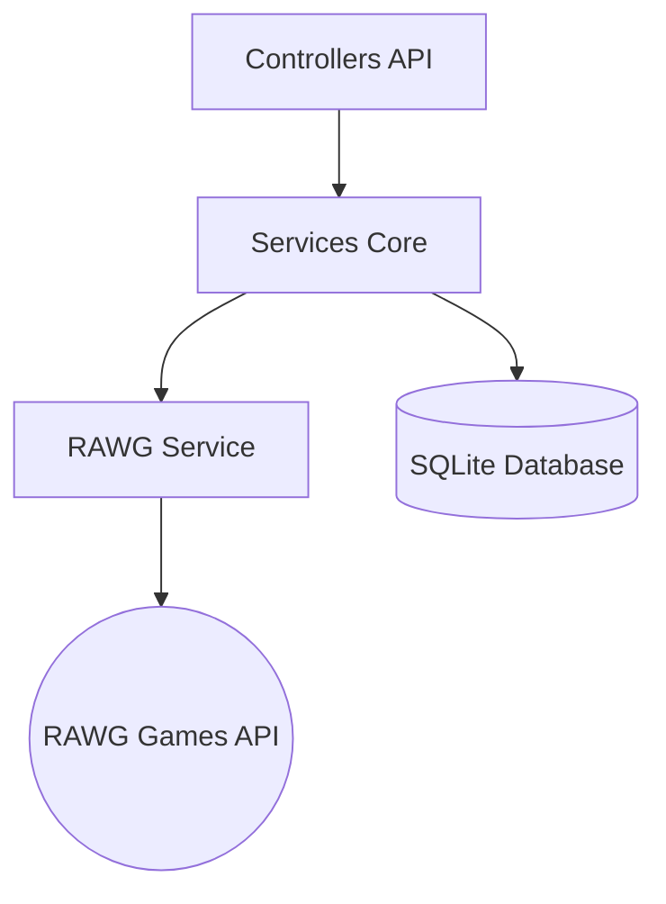

<div align="center">
  <a href="../readme.md">🏠 Visão Geral</a> |
  <a href="../nextplay/README.md">🖥️ Frontend (React)</a> |
  <b>⚙️ Backend (.NET)</b>
</div>

---

# Backend - Gameterapia (.NET 8 API)

A API do Gameterapia atua como o cérebro do sistema, responsável por toda a lógica de curadoria, integração com dados externos e algoritmos de pontuação de recomendação.

## 🧠 Arquitetura do Backend

A aplicação é construída sobre o ecossistema .NET 8, utilizando os princípios de Clean Architecture. 



## 🎯 O Motor de Regras (Algoritmo de Matching)

A principal responsabilidade do Backend é a função `CalculateSkillScore`, que atua como um juiz impiedoso para as recomendações.

### 1. Match de Plataforma
O endpoint aceita parâmetros dinâmicos de Plataforma (ex: 187 para PS5) e os repassa diretamente para a API RAWG, assegurando que o usuário só veja jogos que realmente possui hardware para jogar.

### 2. Tribunal da Vibe (Penalidade Severa)
O sistema lê os metadados de tags (`story-rich`, `fast-paced`, `atmospheric`) e cruza com a seleção da UI. Se um jogo **não** possuir a "Vibe" selecionada pelo usuário, ele recebe uma pontuação **drasticamente negativa**, impedindo que ele apareça na lista final.

### 3. Match de Habilidade Cognitiva (35%)
Mapeamento de macros (ex: Lógica) para micro-gêneros e tags de design game (ex: `puzzle`, `strategy`, `programming`). 

### 4. Filtro de Qualidade - Crítica (30%)
Mesmo passando pelos filtros acima, os jogos sofrem uma etapa final de validação qualitativa utilizando notas do Metacritic (via RAWG) e OpenCritic, garantindo que a recomendação só inclua a "nata" da indústria.

## 🔌 Integrações Externas

### RAWG API
Principal fonte da verdade. Utilizada para buscar jogos, recuperar imagens de alta qualidade, extrair tags detalhadas, gêneros, plataformas e notas críticas.

## 🚀 Configuração e Execução

Para rodar a API localmente:

1. Acesse o diretório:
```bash
cd NextPlay.Api
```

2. Restaure as dependências:
```bash
dotnet restore
```

3. Configure o arquivo `appsettings.Development.json` com sua API Key da RAWG.

4. Execute o projeto:
```bash
dotnet run
```
