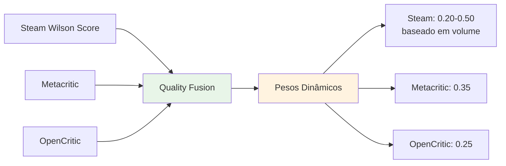
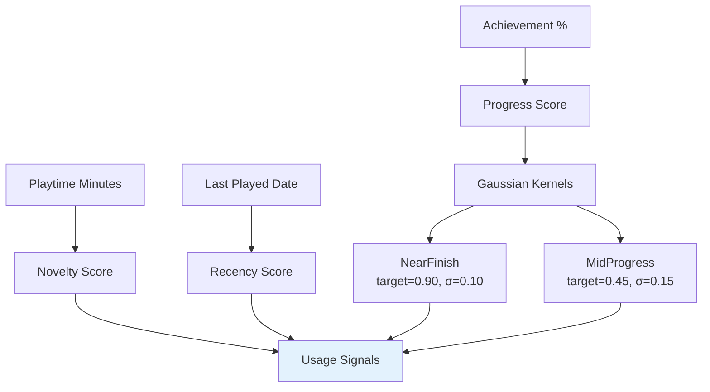

# Algoritmo de Ranqueamento - NextPlay

## Visão Geral

O algoritmo de ranqueamento do NextPlay seleciona o Top 5 jogos da biblioteca Steam do usuário, combinando qualidade externa, progresso, novidade/retomada e aderência ao modo selecionado.

## Fluxo do Algoritmo

```mermaid
flowchart TD
    A[Usuário seleciona modo:<br/>jogar/terminar/zerar/platinar] --> B[Steam API: Obter biblioteca]
    B --> C[Para cada jogo da biblioteca]
    C --> D[Enriquecer com dados de qualidade]
    D --> E[Steam Wilson Score]
    D --> F[Metacritic via RAWG]
    D --> G[OpenCritic]
    E --> H[Calcular qualidade combinada]
    F --> H
    G --> H
    
    H --> I[Calcular sinais de uso]
    I --> J[Novelty: 0min=1.0, ≤120min=0.8, ≤600min=0.5, >600min=0.2]
    I --> K[Recency: ≤7d=0.0, ≤30d=0.5, >90d=1.0]
    I --> L[Progress: % conquistas]
    I --> M[Kernels Gaussianos:<br/>NearFinish, MidProgress]
    
    J --> N[Aplicar fórmula por modo]
    K --> N
    L --> N
    M --> N
    
    N --> O{Modo?}
    O -->|jogar| P[0.55×qualidade + 0.30×novelty + 0.15×recency]
    O -->|terminar| Q[0.55×qualidade + 0.30×midProgress + 0.15×recency]
    O -->|zerar| R[0.55×qualidade + 0.30×nearFinish + 0.15×recency]
    O -->|platinar| S[0.50×qualidade + 0.40×nearFinish + 0.10×(1-recency)]
    
    P --> T[Ordenar por score descendente]
    Q --> T
    R --> T
    S --> T
    
    T --> U[Aplicar diversidade e tie-breakers]
    U --> V[Selecionar Top 5]
    V --> W[Gerar explicações "why"]
    W --> X[Retornar RankingResponse]
    
    style A fill:#e3f2fd
    style H fill:#e8f5e8
    style N fill:#fff3e0
    style X fill:#f3e5f5
```

## Componentes do Algoritmo

### 1. Fontes de Qualidade



### 2. Sinais de Uso



### 3. Fórmulas por Modo

| Modo | Fórmula | Peso Qualidade | Peso Progresso | Peso Recency |
|------|---------|----------------|----------------|--------------|
| **jogar** | 0.55×qualidade + 0.30×novelty + 0.15×recency | 55% | 30% (novelty) | 15% |
| **terminar** | 0.55×qualidade + 0.30×midProgress + 0.15×recency | 55% | 30% (midProgress) | 15% |
| **zerar** | 0.55×qualidade + 0.30×nearFinish + 0.15×recency | 55% | 30% (nearFinish) | 15% |
| **platinar** | 0.50×qualidade + 0.40×nearFinish + 0.10×(1-recency) | 50% | 40% (nearFinish) | 10% (invertido) |

## Implementação Técnica

### Classes Principais

```csharp
// DTOs
public class RankingRequest
{
    public string SteamId64 { get; set; }
    public RankingMode Mode { get; set; } // jogar, terminar, zerar, platinar
    public int Limit { get; set; } = 5;
}

public class RankingResponse
{
    public List<RankingItem> Items { get; set; }
    public int TotalGamesAnalyzed { get; set; }
}

public class RankingItem
{
    public int AppId { get; set; }
    public string Name { get; set; }
    public float FinalScore { get; set; }
    public QualityScores Quality { get; set; }
    public UsageSignals Usage { get; set; }
    public List<string> Why { get; set; } // Explicações
}
```

### Serviços

- **RankingService**: Orquestra o algoritmo completo
- **SteamApiService**: Integração com Steam Web API
- **RawgService**: Enriquecimento com Metacritic

### Endpoint

```
POST /api/ranking/top-games
{
  "steamId64": "76561198000000000",
  "mode": "jogar",
  "limit": 5
}
```

## Explicabilidade

Cada jogo no ranking inclui 2-4 razões explicativas:

### Exemplos de "Why"

- **Qualidade**: "Bem avaliado: Metacritic 87% / Steam 94%"
- **Uso**: "Você jogou pouco (2.5h) - bom para retomar"
- **Progresso**: "Quase terminado (85%) - fácil de finalizar"
- **Modo**: "Combina com seu objetivo de zerar campanhas hoje"

## Robustez

### Dados Faltantes

- **Sem Metacritic/OpenCritic**: Algoritmo funciona apenas com Steam Wilson
- **Sem reviews Steam**: quality_steam = 0.5, reduz peso do Steam
- **Sem progresso**: progress = 0.3, kernels se ajustam naturalmente
- **Sem lastPlayed**: recency = 1.0 (tratado como parado há muito tempo)

### Fallbacks

- **Steam API falha**: Usa dados mock para demonstração
- **RAWG API falha**: Continua sem Metacritic
- **Conflito de fontes**: Aplica trimmed mean se distância > 0.5

## Critérios de Qualidade

✅ **Top 5 prioriza jogos bem avaliados** quando há dados de qualidade externa  
✅ **Estável**: Pequenas variações não reordenam drasticamente  
✅ **Robusto a dados faltantes**: Funciona mesmo com informações limitadas  
✅ **Explicável**: Cada item com motivos claros  
✅ **Diversificado**: Evita 5 jogos do mesmo tipo (quando gêneros disponíveis)
