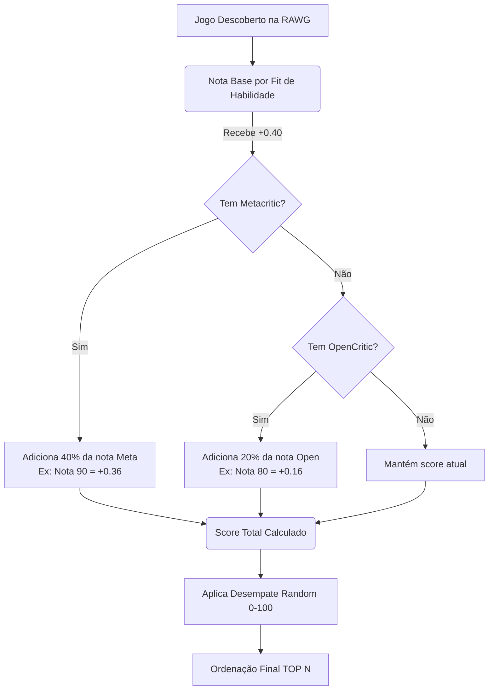

# Fluxo de Recomendações e Algoritmo de Ranqueamento (Gameterapia)

Este documento detalha como o sistema do Gameterapia processa os inputs do usuário, busca dados em fontes externas e seleciona os melhores jogos para recomendar.

## 1. Entrada de Dados (User Input)

O usuário preenche um formulário simples no frontend com três variáveis fundamentais:

*   **`PlatformId`**: Onde o usuário joga (ex: PC, PS5, Xbox, Switch).
*   **`Skill`**: A habilidade cognitiva/social que deseja desenvolver (ex: Lógica, Reflexos, Paciência, Estratégia, Cooperação).
*   **`Time`** (Opcional): A quantidade de tempo que o usuário tem para jogar diariamente (Curto, Médio, Longo).

Esses dados são enviados via `POST` para o endpoint `/api/recommendations` no backend.

## 2. Tradução de Habilidades para Parâmetros de Busca

O `RecommendationService` recebe o request e a primeira etapa é o **Mapeamento de Habilidade (Skill Mapping)**.
A função `MapSkillToTags` traduz a habilidade desejada para termos que os bancos de dados de jogos (RAWG) entendem (gêneros e tags).

Exemplos de mapeamento:
*   **Lógica**: Mapeado para `puzzle`, `strategy`, `logic`.
*   **Reflexos**: Mapeado para `action`, `shooter`, `fast-paced`, `bullet-hell`.
*   **Paciência**: Mapeado para `souls-like`, `roguelike`, `difficult`.
*   **Estratégia**: Mapeado para `strategy`, `resource-management`, `turn-based`.
*   **Cooperação**: Mapeado para `co-op`, `multiplayer`, `local-co-op`.

## 3. Descoberta Inicial (Fetch)

O sistema faz uma chamada à **RAWG API**, passando a string concatenada de tags e gêneros obtidas no passo anterior, juntamente com o tamanho da página (`Limit * 2` para ter uma margem de filtragem).

## 4. Cache e Enriquecimento de Dados

Para cada jogo retornado pela RAWG API:
1.  **Verificação no Banco de Dados (SQLite)**: O sistema verifica se o jogo já foi processado e armazenado. Se não, ele é salvo.
2.  **Enriquecimento de Crítica**: O sistema invoca o `ScoresService` para obter o *Metacritic* ou o *OpenCritic* do jogo. Os scores têm um TTL (Time-To-Live) em memória de 1 hora para evitar chamadas de rede redundantes.
3.  **Enriquecimento de Duração (HLTB)**: O sistema busca a estimativa de tempo médio para zerar o jogo (Main Hours).

## 5. Algoritmo de Scoring (Rankeamento)

O cálculo do score determina quais jogos aparecem primeiro. O processo matemático segue o fluxo abaixo:

```mermaid
flowchart TD
    A[Jogo Descoberto na RAWG] --> B(Nota Base por Fit de Habilidade)
    B -->|Recebe +0.40| C{Tem Metacritic?}
    
    C -- Sim --> D[Adiciona 40% da nota Meta\nEx: Nota 90 = +0.36]
    C -- Não --> E{Tem OpenCritic?}
    
    E -- Sim --> F[Adiciona 20% da nota Open\nEx: Nota 80 = +0.16]
    E -- Não --> G[Mantém score atual]
    
    D --> H(Score Total Calculado)
    F --> H
    G --> H
    
    H --> I[Aplica Desempate Random 0-100]
    I --> J[Ordenação Final TOP N]
```

Cada jogo recebe uma nota interna (de 0.0 a 1.0) baseada na seguinte heurística no método `CalculateSkillScore`:

*   **Qualidade Crítica (60% do peso)**:
    *   Se possuir nota no *Metacritic*, ela compõe 40% da nota (ex: Meta 90 -> adiciona 0.36 ao score).
    *   Se possuir nota no *OpenCritic*, ela compõe 20% da nota.
*   **Fit de Habilidade (40% do peso)**:
    *   O jogo ganha uma pontuação base de 0.40 simplesmente por ter sido retornado pelo motor de busca de tags do RAWG correspondente à habilidade desejada.

## 6. Filtragem de Tempo Diário (Time Filter)

Se o usuário forneceu a variável de **Tempo Diário (`Time`)**, o algoritmo aplica um filtro absoluto na duração total do jogo (`Hltb.MainHours`) para garantir que a recomendação respeite o tempo de vida do jogador:

*   **Curto (< 1h/dia)**: Filtra jogos com duração de `0 a 15 horas`. (Para não levar meses para zerar).
*   **Médio (1-2h/dia)**: Filtra jogos com duração de `10 a 40 horas`.
*   **Longo (3h+/dia)**: Filtra jogos massivos de `30 a 999 horas`.

## 7. Geração de "Motivos" (Why)

Para trazer explicabilidade à IA, o sistema anexa motivos para aquela recomendação em específico (`GenerateSkillReasons`).
Exemplos de motivos gerados automaticamente:
- *"Exercita fortemente o raciocínio lateral e resolução de problemas."*
- *"Aclamado pela crítica mundial (Meta 85+)"*
- *"Excelente título de Puzzle"*

## 8. Retorno e Apresentação

Por fim, a lista é ordenada decrescentemente pelo `ScoreTotal`, e em seguida recebe um fator pseudo-aleatório (`Random().Next(0, 100)`) para desempatar jogos com pontuações idênticas, trazendo variedade a cada requisição. O Top N (determinado pelo `Limit`) é retornado ao frontend para exibição.
