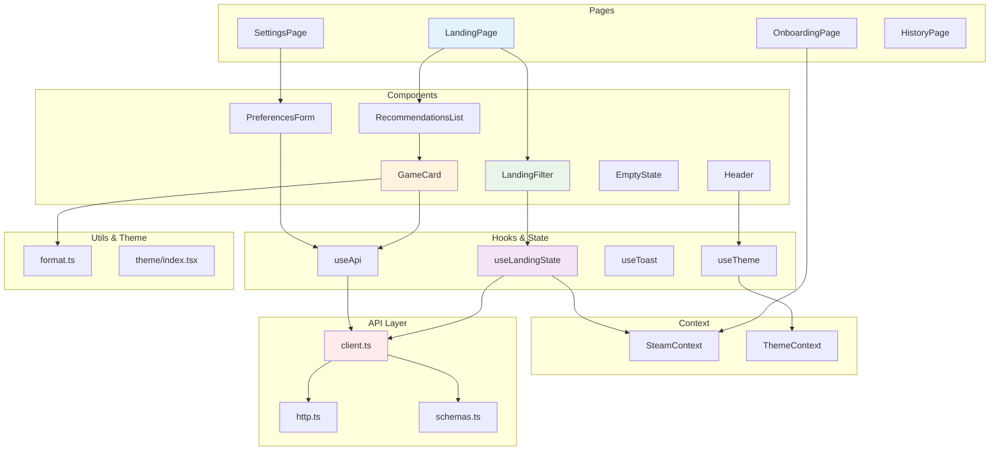

# Arquitetura Frontend - NextPlay

## Estrutura React + TypeScript



## Estrutura de Pastas

```
src/
├── pages/                    # Páginas principais
│   ├── Landing/             # Página inicial com filtros
│   ├── Onboarding/          # Entrada do Steam ID
│   ├── Settings/            # Configurações do usuário
│   └── History/             # Histórico de recomendações
├── components/              # Componentes reutilizáveis
│   ├── Header/              # AppBar de navegação
│   ├── LandingFilter/       # Filtros de recomendação
│   ├── RecommendationsList/ # Grid de recomendações
│   ├── GameCard/            # Card de jogo individual
│   ├── PreferencesForm/     # Formulário de preferências
│   └── EmptyState/          # Estados vazios
├── hooks/                   # Custom hooks
│   ├── useApi.ts            # React Query wrappers
│   ├── useToast.ts          # Notificações
│   ├── useTheme.ts          # Tema escuro/claro
│   └── useLandingState.ts   # Estado dos filtros
├── context/                 # Contextos globais
│   ├── SteamContext.tsx     # Steam ID global
│   └── ThemeContext.tsx     # Tema global
├── api/                     # Camada de API
│   ├── http.ts              # Axios instance
│   ├── client.ts            # Funções de API
│   └── schemas.ts           # Validação Zod
├── utils/                   # Utilitários
│   └── format.ts            # Formatação de dados
├── theme/                   # Configuração de tema
│   └── index.tsx            # Material UI theme
└── routes/                  # Roteamento
    └── AppRoutes.tsx        # Definição de rotas
```

## Camadas e Responsabilidades

### 📄 Pages (Páginas)

- **LandingPage**: Página principal com Hero + Filtros + Recomendações
- **OnboardingPage**: Entrada do Steam ID do usuário
- **SettingsPage**: Configurações e preferências
- **HistoryPage**: Histórico de jogos e feedback

### 🧩 Components (Componentes)

- **Header**: AppBar fixa com navegação e toggle de tema
- **LandingFilter**: Filtros interativos (vibe, duração, etc.)
- **RecommendationsList**: Grid responsivo de recomendações
- **GameCard**: Card individual com capa, notas, ações
- **PreferencesForm**: Formulário de preferências do usuário
- **EmptyState**: Estados vazios reutilizáveis

### 🎣 Hooks (Custom Hooks)

- **useLandingState**: Gerencia estado dos filtros + validação
- **useApi**: Wrappers do React Query para chamadas de API
- **useToast**: Hook para exibir notificações/snackbars
- **useTheme**: Hook para alternar tema escuro/claro

### 🌐 Context (Contextos)

- **SteamContext**: Steam ID global persistido no localStorage
- **ThemeContext**: Tema atual (escuro/claro) global

### 🔌 API Layer (Camada de API)

- **http.ts**: Instância do Axios configurada com interceptors
- **client.ts**: Funções tipadas para chamar endpoints
- **schemas.ts**: Schemas Zod para validação de dados

### 🛠️ Utils & Theme

- **format.ts**: Funções para formatar horas, percentuais, datas
- **theme/index.tsx**: Configuração do Material UI com cores Steam

## Fluxo de Dados

### Estado Local vs Global

- **Local**: Estados de formulário, loading, erros específicos
- **Global**: Steam ID (SteamContext), tema (ThemeContext)

### Gerenciamento de Estado

- **React Query**: Cache de dados da API, loading, error states
- **useState**: Estados locais de componentes
- **Context API**: Estados globais compartilhados

### Comunicação com Backend

```typescript
// 1. Hook customizado
const { data, isLoading, error } = useRecommendByVibe(payload);

// 2. Client API
const response = await apiClient.recommendByVibe(payload);

// 3. HTTP Client
const response = await http.post('/api/recommendations', payload);

// 4. Backend
POST http://localhost:5000/api/recommendations
```

## Padrões e Convenções

### Componentização

- Componentes pequenos e focados
- Props tipadas com TypeScript
- Reutilização através de composição

### Estilização

- Material UI v7 como base
- Tema customizado inspirado na Steam
- Componentes responsivos (mobile-first)

### Validação

- Zod para schemas de API
- Validação client-side nos formulários
- TypeScript para type safety

### Performance

- React Query para cache e otimização
- Lazy loading de componentes pesados
- Memoização quando necessário


