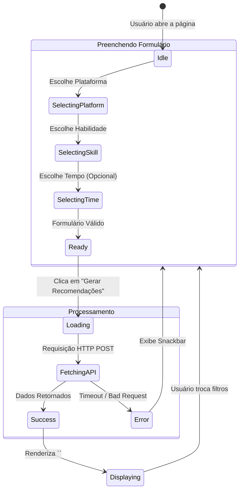

# Arquitetura Frontend (Gameterapia)

O frontend do Gameterapia foi construído como uma SPA (Single Page Application) utilizando **React 18** e **TypeScript**, orquestrado pelo **Vite** para máxima performance de build e carregamento.

## 1. Stack Tecnológico

*   **Core**: React 18, TypeScript
*   **Build Tool**: Vite
*   **Design System & UI**: Material-UI (MUI) v5, Emotion (CSS-in-JS), ícones nativos do `@mui/icons-material`.
*   **Estado e Fetching**: `@tanstack/react-query` (React Query)
*   **Roteamento**: `react-router-dom`
*   **Validação de Dados**: `zod`

## 2. Estrutura de Diretórios

```text
src/
├── api/             # Clientes HTTP (Axios/Fetch), interceptors e schemas do Zod
├── components/      # Componentes de UI reutilizáveis
│   ├── GameCard/    # Cartão de exibição do jogo recomendado
│   ├── Header/      # Barra de navegação minimalista
│   ├── LandingFilter/ # Formulário principal (Plataforma, Skill, Tempo) com Tooltips
│   └── RecommendationsList/ # Grid responsivo de recomendações
├── hooks/           # Custom hooks de lógica de negócios
│   └── useLandingState.ts # Hook que gerencia o estado do formulário e validações
├── pages/           # Componentes de página inteira (View)
│   └── Landing/     # Página principal de recepção e exibição do fluxo
├── routes/          # Definições do React Router
├── theme/           # Configuração de tema global do MUI (cores, tipografia, CssBaseline)
├── App.tsx          # Root component com os providers contextuais
└── main.tsx         # Entry point do React
```

## 3. Fluxo de Estado (State Management)

Em vez de usar Redux ou Zustand, a complexidade do estado no Gameterapia é gerida de forma localizada e assíncrona. O diagrama abaixo mostra o ciclo de vida do estado:


```mermaid
stateDiagram-v2
    [*] --> Idle: Usuário abre a página
    
    state "Preenchendo Formulário" as Form {
        Idle --> SelectingPlatform: Escolhe Plataforma
        SelectingPlatform --> SelectingSkill: Escolhe Habilidade
        SelectingSkill --> SelectingTime: Escolhe Tempo (Opcional)
        SelectingTime --> Ready: Formulário Válido
    }
    
    Ready --> Loading: Clica em "Gerar Recomendações"
    
    state "Processamento" as Proc {
        Loading --> FetchingAPI: Requisição HTTP POST
        FetchingAPI --> Success: Dados Retornados
        FetchingAPI --> Error: Timeout / Bad Request
    }
    
    Error --> Form: Exibe Snackbar
    Success --> Displaying: Renderiza `<RecommendationsList />`
    Displaying --> Form: Usuário troca filtros
```

1.  **Estado da UI e Filtros**: Gerenciado através de `useState` encapsulados no hook `useLandingState`. O zod é usado passivamente para validar se o formulário está pronto para ser enviado (ex: se `PlatformId` e `Skill` não são nulos).
2.  **Estado Remoto (Server State)**: Quando o formulário é enviado, o método de busca faz a chamada via API Client. Os dados retornados (a lista de jogos recomendados) são armazenados e injetados no componente `<RecommendationsList />`.

## 4. Design System (MUI)

O aplicativo utiliza um tema customizado criado em `src/theme/index.tsx`.
*   **Cores Principais**: Gradientes que mesclam `#667eea` e `#764ba2` (Roxo/Azul tech), criando uma vibe moderna de "gaming premium".
*   **Tipografia**: Fontes sem serifa (Inter, Poppins, Roboto).
*   **Layout**: `CssBaseline` aplicado globalmente para remoção de margens nativas dos navegadores, e uso intensivo de `Stack` e `Grid` do MUI para alinhamento e responsividade (mobile-first).
*   **Micro-interações**: Uso extenso de `<Tooltip>` para guiar o usuário em escolhas como "Plataforma" e "Tempo", além de transições de Hover e `<Fade>` / `<Slide>` para animação de entrada dos componentes.
