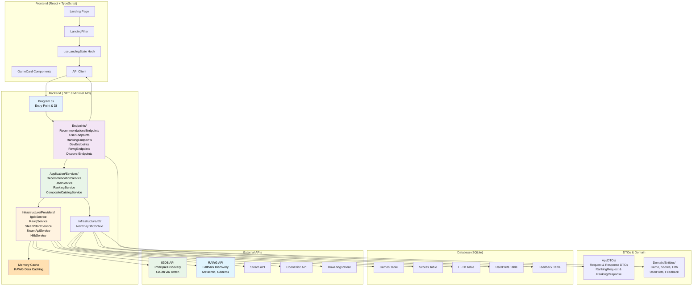

# Arquitetura Geral - NextPlay

## Visão Geral

O NextPlay é uma aplicação de recomendação de jogos composta por:

- **Frontend**: React + TypeScript + Material UI
- **Backend**: .NET 8 Minimal API + EF Core
- **Database**: SQLite
- **Integrações**: Steam, RAWG, OpenCritic, HowLongToBeat



## Componentes Principais

### Frontend

- **Landing Page**: Interface principal com filtros
- **LandingFilter**: Componente de filtros (vibe, duração, etc.)
- **GameCard**: Cards de jogos recomendados
- **useLandingState**: Hook de estado dos filtros
- **API Client**: Cliente HTTP para comunicação com backend

### Backend

- **Program.cs**: Entry point, configuração de DI e middleware
- **Endpoints**: Classes organizadas por domínio (Recommendations, User, Dev)
- **Services**: Lógica de negócio (RecommendationService, UserService, RankingService, CompositeCatalogService)
- **Providers**: Integrações com APIs externas (IgdbService, RawgService, SteamStoreService, SteamApiService, HltbService)
- **Memory Cache**: Cache em memória para tokens OAuth e resultados de descoberta
- **EF Core DbContext**: Acesso a dados com Entity Framework

### Database

- **Games**: Jogos da Steam com metadados
- **Scores**: Notas do Metacritic, OpenCritic, Steam
- **HLTB**: Durações do HowLongToBeat
- **UserPrefs**: Preferências do usuário
- **Feedback**: Likes/Dislikes/Snooze do usuário

## Estrutura de Pastas Atual

```
NextPlay.Api/
├── Program.cs                    # Entry point e configuração
├── Endpoints/                    # Minimal API endpoints organizados
│   ├── RecommendationsEndpoints.cs
│   ├── UserEndpoints.cs
│   ├── RankingEndpoints.cs
│   ├── DevEndpoints.cs
│   ├── RawgEndpoints.cs
│   └── DiscoverEndpoints.cs
├── Application/                  # Camada de aplicação
│   ├── Catalog/
│   │   ├── DiscoverDtos.cs
│   │   └── CompositeCatalogService.cs
│   └── Services/
│       ├── RecommendationService.cs
│       ├── UserService.cs
│       └── RankingService.cs
├── Api/                          # DTOs e contratos
│   └── DTOs/
│       ├── RecommendRequest.cs
│       ├── RecommendationsResponse.cs
│       ├── RankingRequest.cs
│       ├── RankingResponse.cs
│       ├── UserPrefsRequest.cs
│       └── FeedbackRequest.cs
├── Domain/                       # Entidades de domínio
│   └── Entities/
│       ├── Game.cs
│       ├── Scores.cs
│       ├── Hltb.cs
│       ├── UserPrefs.cs
│       └── Feedback.cs
└── Infrastructure/               # Infraestrutura
    ├── Ef/
    │   ├── NextPlayDbContext.cs
    │   └── NextPlayDbContextFactory.cs
    └── Providers/
        ├── IIgdbService.cs
        ├── IgdbService.cs
        ├── IgdbOptions.cs
        ├── IRawgService.cs
        ├── RawgService.cs
        ├── RawgOptions.cs
        ├── SteamStoreService.cs
        ├── SteamApiService.cs
        └── HltbService.cs
```

## Fluxo de Dados

### Sequência de Camadas

1. **Frontend** → HTTP Request
2. **Program.cs** → Roteamento
3. **Endpoints** → Validação e orquestração
4. **Services** → Lógica de negócio
5. **Providers** → APIs externas (se necessário)
6. **DbContext** → Acesso a dados
7. **Database** → Persistência
