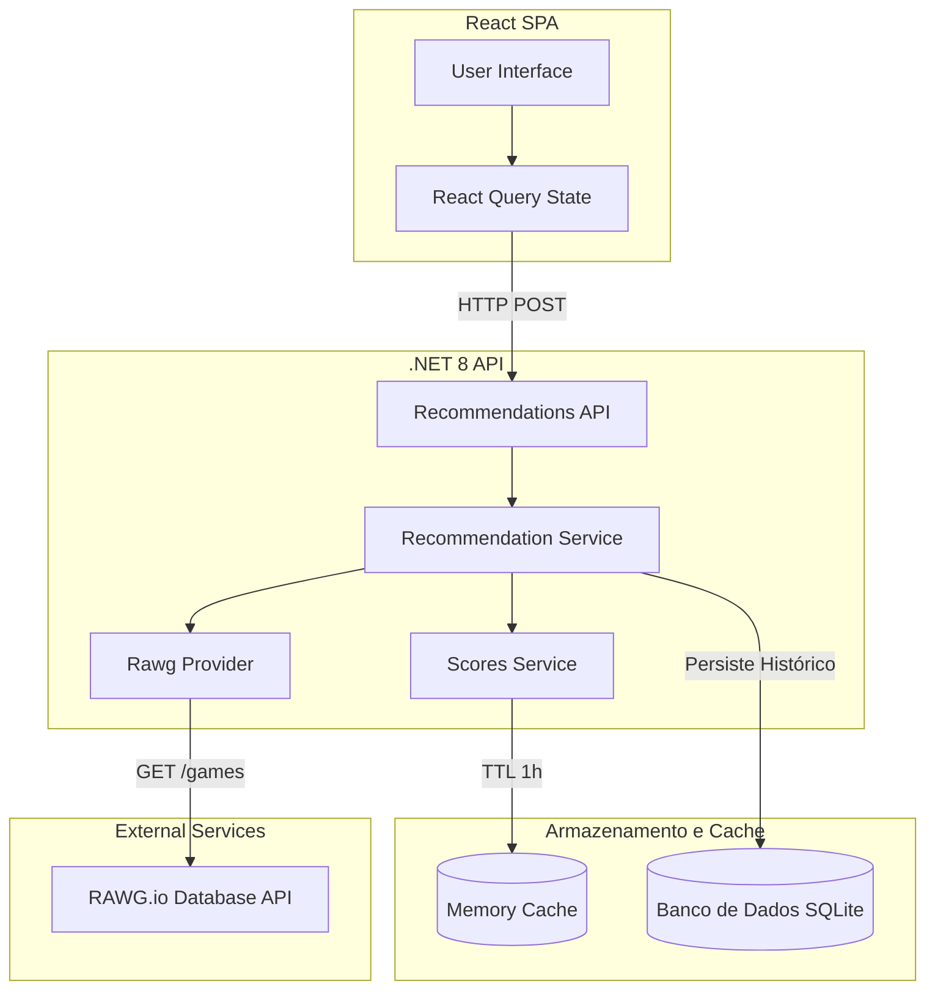

# Arquitetura Geral (Gameterapia)

O Gameterapia adota uma arquitetura clássica **Client-Server**, desacoplada, utilizando **React** no frontend e **.NET 8** no backend, com integração de dados via APIs externas e cache local (SQLite + In-Memory).

## 1. Visão de Alto Nível (High-Level Architecture)

```mermaid
graph TD
    subgraph Frontend [React SPA]
        UI[User Interface] --> State[React Query State]
    end

    subgraph Backend [.NET 8 API]
        Endpoints[Recommendations API] --> Services[Recommendation Service]
        Services --> Scores[Scores Service]
        Services --> Providers[Rawg Provider]
    end

    subgraph Infraestrutura [Armazenamento e Cache]
        MemCache[(Memory Cache)]
        SQLite[(Banco de Dados SQLite)]
    end

    subgraph APIS Externas [External Services]
        RAWG[RAWG.io Database API]
    end

    State -->|HTTP POST| Endpoints
    Providers -->|GET /games| RAWG
    Scores -->|TTL 1h| MemCache
    Services -->|Persiste Histórico| SQLite
```

## 2. Componentes do Sistema

### 2.1. Frontend (Client)
A camada de apresentação. Hospeda o fluxo guiado do usuário (Plataforma, Habilidade, Tempo).
- Recebe a entrada do usuário e aciona a API de curadoria do backend.
- Exibe o grid de jogos recomendados utilizando componentes reutilizáveis (Material-UI).

### 2.2. Backend (API Layer)
Uma aplicação web construída em ASP.NET Core 8.
- **Endpoints**: Oferece rotas limpas e validadas (ex: `POST /api/recommendations`).
- **Services**: A camada de regras de negócio (Application Services). Contém o `RecommendationService`, que faz o levantamento de heurísticas matemáticas e gera a pontuação (Score).
- **Providers (Infrastructure)**: Camadas de abstração que conversam com o banco de dados e APIs externas (`RawgService`, `ScoresService`).

### 2.3. Banco de Dados e Cache
- **SQLite (Entity Framework Core)**: Salva um histórico base dos jogos encontrados para evitar buscas eternas nos mesmos dados e também guardar um histórico de "games já mapeados".
- **MemoryCache (RAM)**: Guarda as notas de crítica de sites por 1 hora, impedindo que requisições simultâneas ao mesmo jogo derretam a cota da API da RAWG.

## 3. Segurança e Performance

- **CORS**: O backend configura uma política de CORS estrita para permitir requisições apenas da URL de origem do frontend.
- **Circuit Breaker / Retries**: O lado do cliente (via React Query) implementa tolerância a falhas na hora de carregar os dados. O backend (via HttpClient) utiliza timeouts curtos (15s) para não deixar a thread presa se a RAWG API cair.
- **Stateless**: O backend não armazena sessões de usuário na memória. Cada requisição é única, determinística e processada independente, o que torna a aplicação perfeitamente "escalável horizontalmente" (Serverless-ready).
