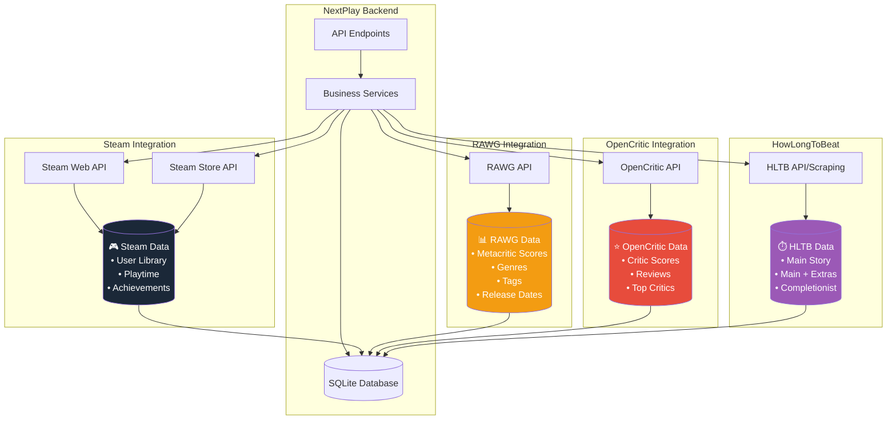

# Integração com APIs Externas - NextPlay

## Visão Geral das Integrações

O NextPlay integra com múltiplas APIs para enriquecer os dados dos jogos.

## Detalhes das Integrações

### 🎮 Steam APIs

#### Steam Web API

- **Endpoint**: `https://api.steampowered.com/`
- **Autenticação**: Steam API Key necessária
- **Dados obtidos**:
  - Lista de jogos do usuário (`GetOwnedGames`)
  - Tempo de jogo e último acesso
  - Conquistas (`GetPlayerAchievements`)

#### Steam Store API

- **Endpoint**: `https://store.steampowered.com/api/`
- **Autenticação**: Não necessária
- **Dados obtidos**:
  - Detalhes do jogo (`appdetails`)
  - Reviews dos usuários
  - Preços e promoções

### 📊 RAWG API (Implementado)

- **Endpoint**: `https://api.rawg.io/api/`
- **Autenticação**: API Key opcional
- **Status**: ✅ **Implementado**
- **Dados obtidos**:
  - Notas do Metacritic
  - Gêneros e tags
  - Data de lançamento
  - Screenshots

### ⭐ OpenCritic API

- **Endpoint**: `https://api.opencritic.com/`
- **Autenticação**: Pode necessitar API Key
- **Status**: ⏳ Pendente
- **Dados obtidos**:
  - Média das notas de críticos
  - Reviews de veículos especializados
  - Top Critics Score

### ⏱️ HowLongToBeat

- **Endpoint**: Não oficial / Web Scraping
- **Autenticação**: Não necessária
- **Status**: ⏳ Pendente
- **Dados obtidos**:
  - Main Story duration
  - Main + Extras duration
  - Completionist duration

## Estratégia de Cache e Atualização

### Cache em Banco

- Todos os dados externos são salvos no SQLite
- Evita chamadas desnecessárias às APIs
- Campo `UpdatedAt` para controle de freshness

### Enriquecimento Lazy

- Dados são buscados sob demanda
- No endpoint `/api/recommendations`, se um jogo não tem Metacritic, busca no RAWG
- Atualiza o banco automaticamente

### Jobs de Sincronização (Futuro)

- **RefreshLibraryJob**: Sincroniza biblioteca Steam periodicamente
- **RefreshScoresJob**: Atualiza notas e HLTB de tempos em tempos
- **Quartz Scheduler**: Execução automática

