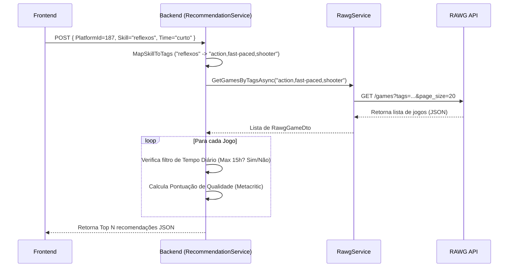

# Fluxo de Integração com APIs (Gameterapia)

O motor de curadoria do Gameterapia depende vitalmente do ecossistema open-source e de bancos de dados da internet para formar uma recomendação justa, rica em contexto e que de fato melhore a habilidade desejada pelo jogador.

O projeto removeu dependências fechadas (como login da Steam) e hoje é agnóstico. A única e principal fonte de verdade é a **RAWG Video Games Database API**.

## 1. Mapeamento de APIs

### RAWG API (`api.rawg.io`)
É o coração do sistema. Uma base RESTful colossal com mais de 800.000 jogos e inteligência atrelada.
*   **Responsabilidade**: Descoberta de jogos por Tags/Gêneros, busca de Metacritic score, e extração de arte gráfica (background_image).
*   **Limites**: Rate limit de requisições mensais (gratuitas), mitigado pelo uso de Cache em Memória no C#.
*   **Endpoints consumidos**:
    *   `/games?tags={tags}&page_size={limit}` (Para fazer o discover inicial).
    *   `/games/{id}` (Para detalhes aprofundados, se aplicável).

## 2. Fluxo da Resolução de um Jogo

Quando um usuário envia o formulário "Quero desenvolver Reflexos em jogos Curtos de PS5":

```mermaid
sequenceDiagram
    participant Frontend
    participant Backend (RecommendationService)
    participant RawgService
    participant RAWG API
    
    Frontend->>Backend (RecommendationService): POST { PlatformId=187, Skill="reflexos", Time="curto" }
    
    Backend (RecommendationService)->>Backend (RecommendationService): MapSkillToTags ("reflexos" -> "action,fast-paced,shooter")
    
    Backend (RecommendationService)->>RawgService: GetGamesByTagsAsync("action,fast-paced,shooter")
    
    RawgService->>RAWG API: GET /games?tags=...&page_size=20
    RAWG API-->>RawgService: Retorna lista de jogos (JSON)
    RawgService-->>Backend (RecommendationService): Lista de RawgGameDto
    
    loop Para cada Jogo
        Backend (RecommendationService)->>Backend (RecommendationService): Verifica filtro de Tempo Diário (Max 15h? Sim/Não)
        Backend (RecommendationService)->>Backend (RecommendationService): Calcula Pontuação de Qualidade (Metacritic)
    end
    
    Backend (RecommendationService)-->>Frontend: Retorna Top N recomendações JSON
```

## 3. Estratégias de Resiliência

*   **Timeout Handling**: Se a API da RAWG demorar mais de 15 segundos para responder, a chamada é abortada internamente e um Warning é registrado. O aplicativo devolverá os jogos cacheados ou sinalizará erro tratado para a interface.
*   **Reserva de Dados Locais**: Todo jogo descoberto é imediatamente registrado na tabela `Games` do SQLite (`AppId`, `Name`, `HeaderImage`, `Genres`). No futuro, o aplicativo pode servir recomendações puramente via SQLite sem bater na internet, funcionando como um indexador local.
