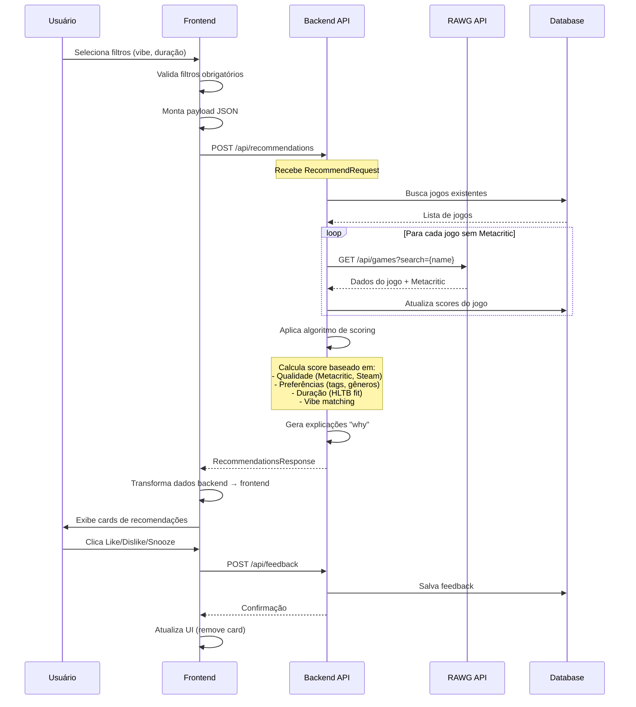

# Fluxo de Recomendações - NextPlay

## Sequência Completa

Este diagrama mostra o fluxo completo desde a seleção de filtros até a exibição de recomendações.



## Etapas Detalhadas

### 1. Seleção de Filtros

- Usuário seleciona **vibe** (obrigatório): relax, história, raiva, etc.
- Usuário seleciona **duração** (obrigatório): rápido, médio, longo, muito longo
- Filtros opcionais: energia, social, conteúdo, controle, idioma, estrutura, sabores

### 2. Validação Frontend

- Hook `useLandingState` valida se campos obrigatórios estão preenchidos
- Botão "Ver recomendações" só fica habilitado com vibe + duração
- Monta payload JSON conforme schema da API

### 3. Processamento Backend

- Endpoint `/api/recommendations` recebe `RecommendRequest`
- Busca jogos existentes no banco SQLite
- **Enriquecimento em tempo real**: Para jogos sem Metacritic, chama RAWG API
- Atualiza banco com novos dados obtidos

### 4. Algoritmo de Scoring

```
score_total = 
  Wq * quality +           // Metacritic, OpenCritic, Steam
  Wp * preferences +       // Tags/gêneros favoritos
  Wa * duration_fit +      // Adequação HLTB à duração desejada
  Wr * recency +          // Jogos mais recentes
  Wc * compatibility +    // PT-BR, controller
  Wm * mood_match         // Vibe específica
```

### 5. Geração de Explicações

- Função `GenerateWhyReasons()` cria lista de motivos
- Exemplos: "High critic scores", "Perfect duration", "Matches your preferred genres"

### 6. Resposta e Exibição

- Backend retorna `RecommendationsResponse` com lista ordenada
- Frontend transforma dados para formato interno
- Exibe cards com capas, notas, duração HLTB, razões

### 7. Feedback do Usuário

- Botões Like/Dislike/Snooze em cada card
- Chama `/api/feedback` para salvar preferência
- Remove card da lista (otimistic update)


