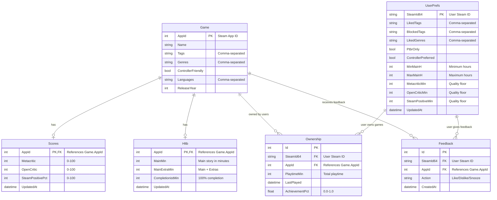

# Modelo de Dados - NextPlay

## Diagrama Entidade-Relacionamento



## Entidades Detalhadas

### 🎮 Game

**Entidade central** que representa um jogo da Steam.

- `AppId`: ID único do jogo na Steam (Primary Key)
- `Name`: Nome do jogo
- `Tags`: Tags do jogo (armazenadas como string separada por vírgulas)
- `Genres`: Gêneros (armazenados como string separada por vírgulas)
- `ControllerFriendly`: Se suporta controle
- `Languages`: Idiomas suportados
- `ReleaseYear`: Ano de lançamento

### 📊 Scores

**Notas e avaliações** do jogo de diferentes fontes.

- `AppId`: FK para Game (também PK)
- `Metacritic`: Nota do Metacritic (0-100)
- `OpenCritic`: Nota do OpenCritic (0-100)
- `SteamPositivePct`: Porcentagem de reviews positivas na Steam
- `UpdatedAt`: Quando foi atualizado pela última vez

### ⏱️ Hltb (HowLongToBeat)

**Durações de gameplay** para diferentes estilos de jogo.

- `AppId`: FK para Game (também PK)
- `MainMin`: História principal em minutos
- `MainExtraMin`: Principal + extras em minutos
- `CompletionistMin`: Completar 100% em minutos
- `UpdatedAt`: Quando foi atualizado

### 👤 Ownership

**Relacionamento** entre usuários e jogos que possuem.

- `Id`: Primary Key
- `SteamId64`: ID Steam do usuário
- `AppId`: FK para Game
- `PlaytimeMin`: Tempo total jogado em minutos
- `LastPlayed`: Quando jogou pela última vez
- `AchievementPct`: Porcentagem de conquistas (0.0-1.0)

### ⚙️ UserPrefs

**Preferências personalizadas** de cada usuário.

- `SteamId64`: ID Steam do usuário (PK)
- `LikedTags`: Tags favoritas
- `BlockedTags`: Tags bloqueadas
- `LikedGenres`: Gêneros favoritos
- `PtbrOnly`: Se quer apenas jogos em PT-BR
- `ControllerPreferred`: Se prefere jogos com suporte a controle
- `MinMainH`/`MaxMainH`: Faixa de duração preferida
- `MetacriticMin`/`OpenCriticMin`/`SteamPositiveMin`: Pisos de qualidade

### 👍 Feedback

**Feedback do usuário** sobre recomendações.

- `Id`: Primary Key
- `SteamId64`: ID Steam do usuário
- `AppId`: FK para Game
- `Action`: "Like", "Dislike", ou "Snooze"
- `CreatedAt`: Quando o feedback foi dado

## Estratégias de Armazenamento

### Arrays como Strings

Tags, gêneros e idiomas são armazenados como strings separadas por vírgulas:

```
Tags: "Action,Adventure,RPG"
Genres: "Action,Role-Playing"
Languages: "English,Portuguese,Spanish"
```

### Value Converters (EF Core)

```csharp
modelBuilder.Entity<Game>()
    .Property(g => g.Tags)
    .HasConversion(
        v => string.Join(',', v),
        v => v.Split(',', StringSplitOptions.RemoveEmptyEntries)
    );
```

### Relacionamentos

- **1:1**: Game ↔ Scores, Game ↔ Hltb
- **1:N**: Game → Ownership, Game → Feedback
- **1:N**: UserPrefs → Ownership, UserPrefs → Feedback


