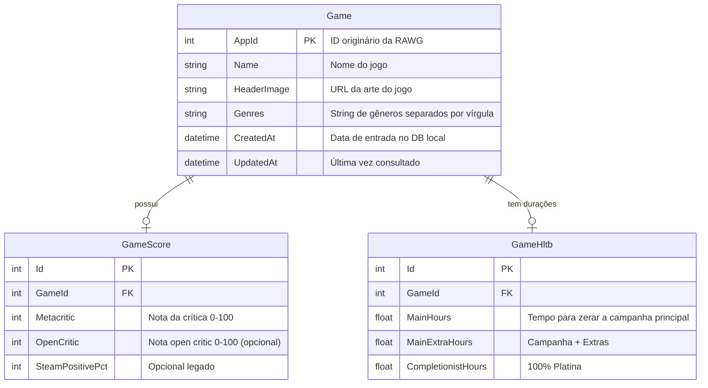

# Modelo de Dados (Gameterapia)

Com a arquitetura reestruturada e a dependência da API da Steam removida, o banco de dados interno do Gameterapia (SQLite via Entity Framework Core) foi simplificado drasticamente. 

Sua função primária não é gerenciar usuários, mas sim agir como um **Catálogo Cacheado** dos jogos já descobertos, guardando histórico e impedindo consultas repetidas sobre os mesmos IDs no provedor (RAWG).

## 1. Diagrama de Entidades (Entity Relationship Diagram)

```mermaid
erDiagram
    Game ||--o| GameScore : "possui"
    Game ||--o| GameHltb : "tem durações"

    Game {
        int AppId PK "ID originário da RAWG"
        string Name "Nome do jogo"
        string HeaderImage "URL da arte do jogo"
        string Genres "String de gêneros separados por vírgula"
        datetime CreatedAt "Data de entrada no DB local"
        datetime UpdatedAt "Última vez consultado"
    }

    GameScore {
        int Id PK
        int GameId FK
        int Metacritic "Nota da crítica 0-100"
        int OpenCritic "Nota open critic 0-100 (opcional)"
        int SteamPositivePct "Opcional legado"
    }

    GameHltb {
        int Id PK
        int GameId FK
        float MainHours "Tempo para zerar a campanha principal"
        float MainExtraHours "Campanha + Extras"
        float CompletionistHours "100% Platina"
    }
```

## 2. Detalhamento das Entidades

### `Game` (`dbo.Games`)
A tabela central de armazenamento em cache. Quando o motor de curadoria encontra um jogo novo baseado nas Skills do usuário, o sistema verifica se `AppId` (ID da RAWG) já existe aqui. Se não, o jogo é persistido.

### `GameScore` (`dbo.Scores`)
Como as notas do Metacritic raramente flutuam anos após o lançamento de um jogo, o sistema salva esses dados relacionalmente. Dessa forma, para os jogos mais recomendados do servidor, o processamento de pontuação é feito a frio (`O(1)`), diretamente via banco de dados sem a necessidade de instanciar serviços REST.

### `GameHltb` (`dbo.Hltbs`)
Dados referentes a duração do jogo (How Long To Beat). São vitais para cruzar com a variável `Time` que o usuário envia no frontend (Tempo Diário). O sistema verifica `MainHours` para garantir que o usuário que joga 1 hora por dia não seja recomendado um jogo de 120 horas se ele optou por uma experiência "Curta".

## 3. Decisões Arquiteturais de Persistência
- **Fim da Tabela de Usuários**: Como a filosofia atual não rastreia SteamID, não há mais tabela de `Users` ou `Ownerships`. Isso garantiu conformidade total com privacidade (LGPD/GDPR) e eliminou 90% da latência dos antigos relacionamentos de banco N+1.
- **SQLite**: Utilizado pelo perfil de baixo custo e alta velocidade para projetos de Catálogo e Cache local. Não necessita de infraestrutura dedicada em nuvem (como um cluster PostgreSQL).
