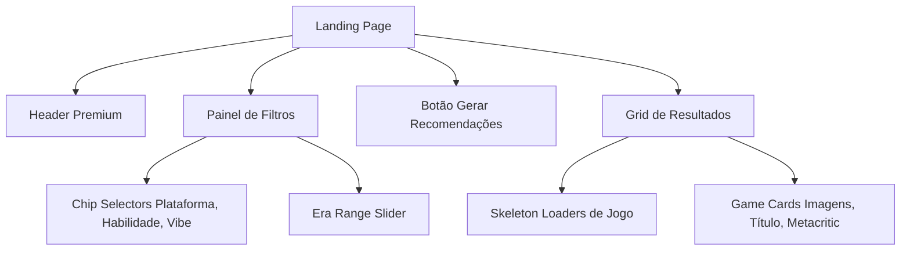

<div align="center">
  <a href="../readme.md">🏠 Visão Geral</a> |
  <b>🖥️ Frontend (React)</b> |
  <a href="../NextPlay.Api/README.md">⚙️ Backend (.NET)</a>
</div>

---

# Frontend - Gameterapia (React + Vite)

A interface de usuário do Gameterapia foi desenvolvida com foco em proporcionar uma experiência premium, reativa e intuitiva. 

## 🎨 Visão Geral da Interface

O painel principal ("Treino Gamer") é um laboratório de configuração onde o usuário constrói sua solicitação de recomendação:

- **Plataformas:** Seleção de onde o usuário joga (PC, PS5, Xbox, Switch).
- **Habilidades Cognitivas:** 10 opções de habilidades mapeadas (Lógica, Estratégia, Reflexos, etc.) com descrições dinâmicas dos benefícios neurológicos.
- **Vibes (Filtro Psicológico):** Filtros imersivos como "História", "Relaxante", "Frenético" ou "Retrô" que atuam diretamente na formulação da nota do jogo.
- **Era do Jogo:** Um slider duplo que permite limitar o ano de lançamento dos jogos (ex: 1990 a 2026).

## 🛠️ Stack Tecnológica

- **React 18** e **TypeScript:** Para uma interface rápida, segura e livre de erros em tempo de execução.
- **Vite:** Ferramenta de build que garante inicialização e HMR (Hot Module Replacement) instantâneos.
- **Material-UI (MUI):** Sistema de design utilizado para a criação de componentes padronizados (Chips, Sliders, Cards, Skeletons).
- **React Query:** Para o gerenciamento de chamadas assíncronas ao backend, garantindo cache e estados de carregamento fluidos.
- **Axios:** Cliente HTTP para comunicação com a API .NET.
- **CSS Vanilla (Variáveis e Flexbox):** Utilizado para polimentos estéticos refinados e animações de hover que dão vida à interface.

## 🏗️ Estrutura de Componentes



## 🚀 Como Executar

Estando dentro da pasta `nextplay`:

1. Instale as dependências:
```bash
pnpm install
```

2. Execute o servidor de desenvolvimento:
```bash
pnpm dev
```
