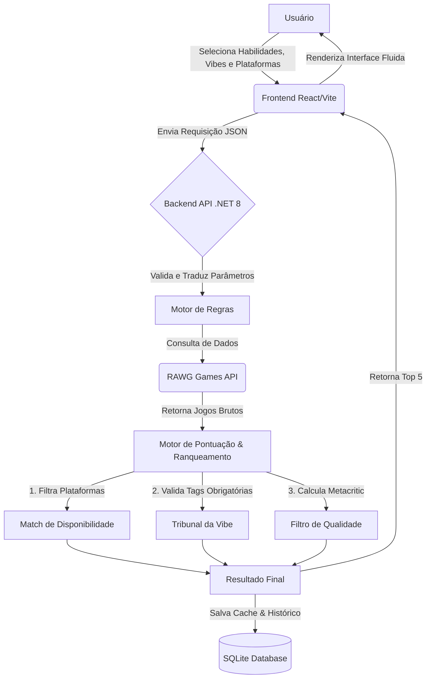

<div align="center">
  <b>🏠 Visão Geral</b> |
  <a href="nextplay/README.md">🖥️ Frontend (React)</a> |
  <a href="NextPlay.Api/README.md">⚙️ Backend (.NET)</a>
</div>

---

# 🎮 Gameterapia (NextPlay)

> **Transforme seu tempo de jogo em desenvolvimento pessoal.** O Gameterapia é um sistema inteligente de curadoria e recomendação que ajuda você a encontrar o jogo perfeito não apenas para se divertir, mas para desenvolver habilidades cognitivas específicas como Lógica, Reflexos, Estratégia e Resiliência.

[](https://dotnet.microsoft.com/)
[](https://reactjs.org/)
[](https://www.typescriptlang.org/)

---

## 🎯 O Desafio e a Solução

Jogar videogame frequentemente é visto apenas como entretenimento. No entanto, estudos mostram que jogos complexos melhoram a coordenação motora, a tomada de decisão sob pressão e o pensamento lateral. 

O **Gameterapia** resolve o problema do "o que jogar agora?" através de um algoritmo de _matching_ avançado. O usuário define o que quer treinar, sua "vibe" do dia, as plataformas que possui e a época de lançamento. O motor cruza dados de APIs mundiais de games para entregar recomendações precisas, filtrando os jogos não só pelo gênero, mas por uma verdadeira **afinidade psicológica**.

## 🧠 Arquitetura e Fluxo de Decisão

O sistema utiliza uma arquitetura robusta baseada em Microsserviços e um Frontend reativo. O fluxo de decisão em tempo real pode ser visto no diagrama abaixo:



---

## 📦 Estrutura do Projeto

O projeto foi dividido em módulos para facilitar a escalabilidade e manutenção. Você pode conferir os detalhes técnicos de cada parte acessando suas documentações específicas:

- 🖥️ **[Frontend (React + Vite)](nextplay/README.md):** Interface do usuário moderna, componentizada com Material-UI e focada na experiência (UX).
- ⚙️ **[Backend (API .NET 8)](NextPlay.Api/README.md):** O motor de regras C#, algoritmos de pontuação de afinidade, integração com a RAWG API e Steam, e banco de dados SQLite.

---

## 🚀 Como Executar Localmente

### Pré-requisitos
- [.NET 8 SDK](https://dotnet.microsoft.com/download/dotnet/8.0)
- [Node.js 18+](https://nodejs.org/)
- [pnpm](https://pnpm.io/)

### 1. Backend (API)
```bash
cd NextPlay.Api
dotnet restore
dotnet run
```

### 2. Frontend (Interface)
```bash
cd nextplay
pnpm install
pnpm dev
```

---

## 👨‍💻 Autor

**Adley Rodrigues**
- 💼 **LinkedIn**: [linkedin.com/in/adley-rodrigues-9168581a4](https://www.linkedin.com/in/adley-rodrigues-9168581a4/)
- 🐙 **GitHub**: [@AdleyRodrigues](https://github.com/AdleyRodrigues)