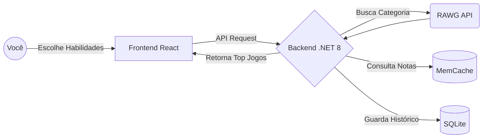

# 🎮 Gameterapia (antigo NextPlay)

[](https://dotnet.microsoft.com/)
[](https://reactjs.org/)
[](https://www.typescriptlang.org/)
[](LICENSE)

> **Transforme seu tempo de jogo em desenvolvimento pessoal.** O Gameterapia é um sistema inteligente de curadoria e recomendação que te ajuda a encontrar o jogo perfeito não apenas para se divertir, mas para desenvolver habilidades específicas como Lógica, Reflexos, Estratégia e Paciência.

---

## 🎯 Por que este projeto existe?

Jogar videogame frequentemente é visto apenas como entretenimento. No entanto, diversos estudos mostram que jogos complexos podem melhorar a coordenação motora, a tomada de decisão sob pressão, o pensamento lateral e a resiliência. 

O **Gameterapia** resolve o problema do "o que jogar agora?" direcionando o usuário para títulos aclamados pela crítica que vão além da diversão, servindo como uma ferramenta de desenvolvimento cognitivo baseada no perfil e no tempo diário disponível do jogador.

---

## 🧠 Como funciona?

O fluxo da aplicação é projetado para máxima performance e inteligência. Veja a visão geral da arquitetura:



O Gameterapia utiliza um algoritmo de matching avançado que cruza dados de APIs de games com o perfil de desenvolvimento desejado:

### 📊 **Perfil do Jogador**
- **Onde joga:** PC, PlayStation 5, Xbox Series X/S, Nintendo Switch.
- **O que quer desenvolver:** Habilidades como Lógica, Reflexos, Paciência, Estratégia ou Cooperação.
- **Tempo diário:** Curto (< 1h/dia), Médio (1-2h/dia), Longo (3h+/dia). O algoritmo adapta a recomendação buscando jogos cuja duração total (HLTB) se encaixe na janela do jogador para evitar abandono de campanha.

### 🏆 **Avaliação de Qualidade e Curadoria**
- **Integração com RAWG API:** Busca de metadados, notas do Metacritic e tags.
- **Tradução de Habilidades:** O sistema mapeia o input do usuário para gêneros e subgêneros (ex: "Paciência" = Souls-like, Roguelike).

### 🎯 **Algoritmo de Matching**
```text
Score Final = 60% Qualidade da Crítica (Metacritic/OpenCritic) + 40% Fit de Habilidade
```
Cada recomendação inclui **explicações claras** do porquê foi sugerida, como "Exercita fortemente o raciocínio lateral" ou "Aclamado pela crítica mundial".

---

## 🛠️ Tecnologias Utilizadas

### **Frontend**
- **React 18** + **TypeScript** - Interface moderna e type-safe
- **Vite** - Build ultra-rápido
- **Material-UI (MUI)** - Componentes responsivos e sistema de design
- **React Query** - Gerenciamento de estado e cache de chamadas HTTP
- **React Router** - Navegação fluida
- **Zod** - Validação de dados de formulário

### **Backend**
- **.NET 8** - API moderna e performática
- **Entity Framework Core** - ORM robusto com SQLite
- **Serilog** - Logging estruturado
- **MemCache** - Cache em memória para minimizar consumo de API

### **Integrações Externas**
- **RAWG API** - Maior banco de dados open-source de videogames

---

## 🚀 Instalação e Execução

### **Pré-requisitos**
- [.NET 8 SDK](https://dotnet.microsoft.com/download/dotnet/8.0)
- [Node.js 18+](https://nodejs.org/)
- [pnpm](https://pnpm.io/) (recomendado)

### **1. Clone o repositório**
```bash
git clone https://github.com/AdleyRodrigues/NextPlay.git
cd NextPlay
```

### **2. Configure o Backend (.NET)**
```bash
cd NextPlay.Api
dotnet restore
dotnet run
```

### **3. Configure o Frontend (React)**
```bash
cd nextplay
pnpm install
pnpm dev
```

### **4. Acesse a aplicação**
- **Frontend**: http://localhost:5173
- **Backend API**: http://localhost:5130
- **Swagger UI**: http://localhost:5130/swagger

---

## 👨‍💻 Autor

**Adley Rodrigues**
- 💼 **LinkedIn**: [linkedin.com/in/adley-rodrigues-9168581a4](https://www.linkedin.com/in/adley-rodrigues-9168581a4/)
- 📧 **Email**: adleyrc.job@gmail.com
- 🐙 **GitHub**: [@AdleyRodrigues](https://github.com/AdleyRodrigues)

---

## 📄 Licença

Este projeto está licenciado sob a **Licença MIT** - veja o arquivo [LICENSE](LICENSE) para detalhes.